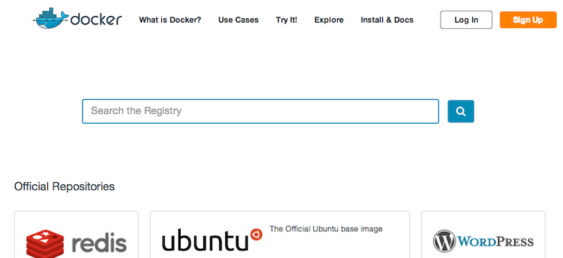

这一篇是来介绍跟镜像有关的基本操作，便于对镜像的使用有个很好的了解。

####列出所有镜像

	$ sudo docker images
	REPOSITORY       TAG      IMAGE ID      CREATED      VIRTUAL SIZE
	training/webapp  latest   fc77f57ad303  3 weeks ago  280.5 MB
	ubuntu           13.10    5e019ab7bf6d  4 weeks ago  180 MB
	ubuntu           saucy    5e019ab7bf6d  4 weeks ago  180 MB
	ubuntu           12.04    74fe38d11401  4 weeks ago  209.6 MB
	ubuntu           precise  74fe38d11401  4 weeks ago  209.6 MB
	ubuntu           12.10    a7cf8ae4e998  4 weeks ago  171.3 MB
	ubuntu           quantal  a7cf8ae4e998  4 weeks ago  171.3 MB
	ubuntu           14.04    99ec81b80c55  4 weeks ago  266 MB
	ubuntu           latest   99ec81b80c55  4 weeks ago  266 MB
	ubuntu           trusty   99ec81b80c55  4 weeks ago  266 MB
	ubuntu           13.04    316b678ddf48  4 weeks ago  169.4 MB
	ubuntu           raring   316b678ddf48  4 weeks ago  169.4 MB
	ubuntu           10.04    3db9c44f4520  4 weeks ago  183 MB
	ubuntu           lucid    3db9c44f4520  4 weeks ago  183 MB

用这个命令可以看到镜像的名字、版本、ID号。

可以指定执行某一个版本的镜像，`$ sudo docker run -t -i ubuntu:12.04 /bin/bash`

如果不指定具体的版本号，会默认用`latest`的那个镜像。

####下载一个新镜像

	$ sudo docker pull centos
	Pulling repository centos
	b7de3133ff98: Pulling dependent layers
	5cc9e91966f7: Pulling fs layer
	511136ea3c5a: Download complete
	ef52fb1fe610: Download complete
	. . .

	Status: Downloaded newer image for centos
	
####查找一个镜像

1. 可以通过网页来搜索镜像
	
	
	
2. 可以用命令来搜索

如下：

	$ sudo docker search sinatra
	NAME                                   DESCRIPTION                                     STARS     OFFICIAL   AUTOMATED
	training/sinatra                       Sinatra training image                          0                    [OK]
	marceldegraaf/sinatra                  Sinatra test app                                0
	mattwarren/docker-sinatra-demo                                                         0                    [OK]
	luisbebop/docker-sinatra-hello-world                                                   0                    [OK]
	bmorearty/handson-sinatra              handson-ruby + Sinatra for Hands on with D...   0
	subwiz/sinatra                                                                         0
	bmorearty/sinatra                                                                      0

####下拉一个镜像

	$ sudo docker pull training/sinatra
	
####创建自己的镜像

1. 我们可以使用某一个镜像，然后更新其中的操作，然后commit
2. 我们可以用Dockerfile自己创建一个

#####更新并提交一个现有镜像
首先把这个镜像运行起来，
	
	$ sudo docker run -t -i training/sinatra /bin/bash
	root@0b2616b0e5a8:/#
	
然后在里面执行一些需要的操作，如：

	root@0b2616b0e5a8:/# gem install json
	
然后，敲`exit`命令来退出镜像。

然后，提交这个修改

	$ sudo docker commit -m="Added json gem" -a="Kate Smith" \
	0b2616b0e5a8 ouruser/sinatra:v2
	
	4f177bd27a9ff0f6dc2a830403925b5360bfe0b93d476f7fc3231110e7f71b1c
	
其中`-m`参数是添加备注。`-a`参数是指定作者。
`0b2616b0e5a8`是开始我们修改的镜像的id，`ouruser/sinatra:v2`是我们要新创建的镜像的名字，这里虽然用了原来的sinatra名字，但是加了个标签v2。

重新执行

	$ sudo docker images
	REPOSITORY          TAG     IMAGE ID       CREATED       VIRTUAL SIZE
	training/sinatra    latest  5bc342fa0b91   10 hours ago  446.7 MB
	ouruser/sinatra     v2      3c59e02ddd1a   10 hours ago  446.7 MB
	ouruser/sinatra     latest  5db5f8471261   10 hours ago  446.7 MB
	
####给某一个镜像加标签

	sudo docker tag 5db5f8471261 ouruser/sinatra:devel
重新执行
	
	$ sudo docker images ouruser/sinatra
	REPOSITORY          TAG     IMAGE ID      CREATED        VIRTUAL SIZE
	ouruser/sinatra     latest  5db5f8471261  11 hours ago   446.7 MB
	ouruser/sinatra     devel   5db5f8471261  11 hours ago   446.7 MB
	ouruser/sinatra     v2      5db5f8471261  11 hours ago   446.7 MB
	
	
####把镜像上传dockerhub

	$ sudo docker push ouruser/sinatra
	
####删除主机上的镜像

	$ sudo docker rmi training/sinatra
	
	